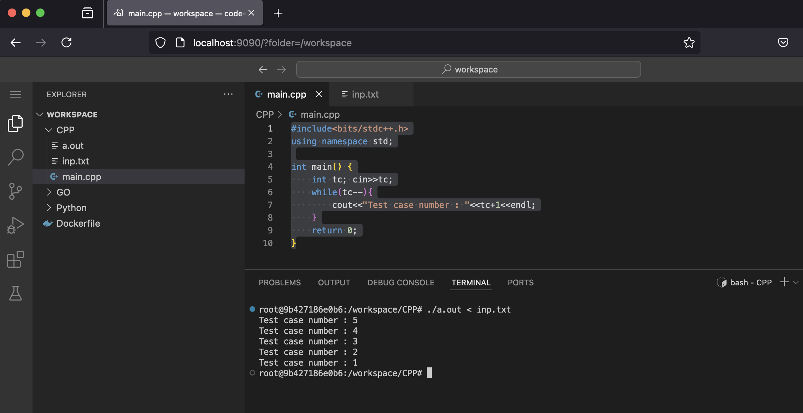

# Docker Images Repository

This repository contains all the useful docker images built for specific purpose

1. Dev Env Docker 
This docker image pulls an ubuntu server, and builds a vs-code server on top of it, to be accessible on port 9090 from any web browser on the local system. 

### Purpose 
This is specifically built for spining up a coding env, with Python, Go and C++ installed to get started with competitive programming. 

